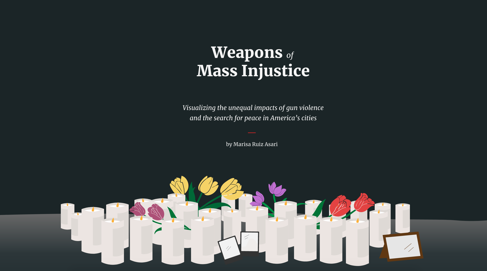
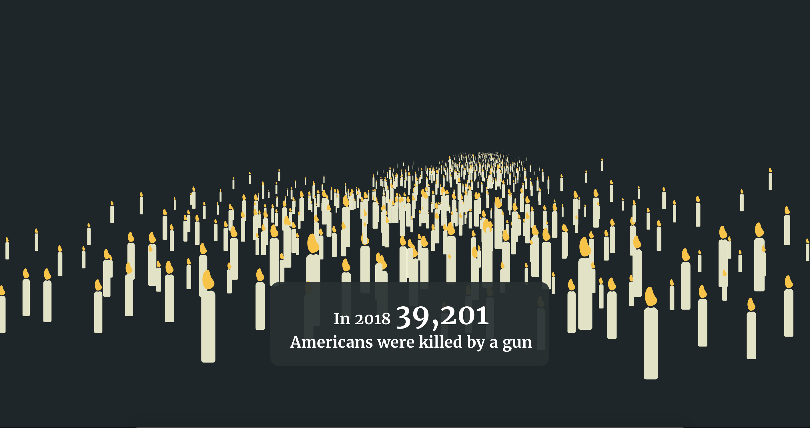
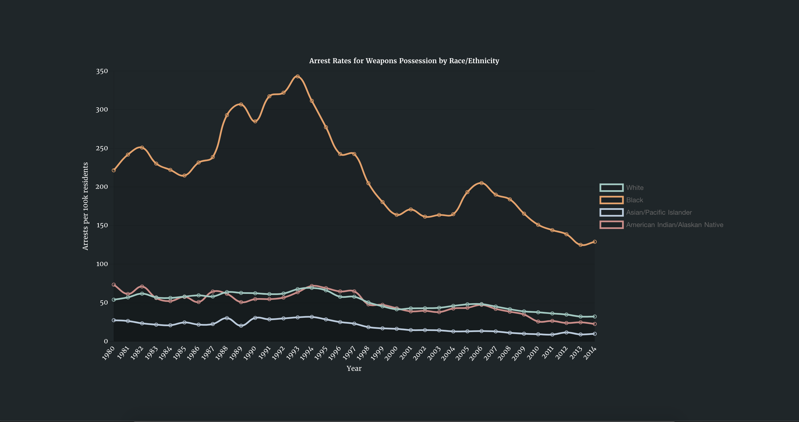

# Weapons of Mass Injustice

### Visualizing the unequal impacts of gun violence and the search for peace in America’s cities

By [Marisa Ruiz Asari](saasari.com) // [View live project](https://weaponsofmassinjustice.netlify.app) // [Parsons 2020 Data Visualization](https://parsons.nyc/thesis-2020/)

Abstract
------

Over the past decade, gun violence has risen to the forefront of the American political and social agenda. Yet the story of American gun violence is focused on mass shootings that, while horrifyingly symbolic of the country’s gun crisis, represent a small fraction of firearm deaths every year. Weapons of Mass Injustice is a visual essay highlighting forms of gun violence that often go overlooked in media and policy discussions. The project examines the inequitable impacts of this violence and their connection to the criminalization of black and brown youth in the US. Using a scroll based storytelling or “scrollytelling” approach, the project visually deconstructs federal firearm and criminal justice data that, despite being publicly available, are often rendered inaccessible to the general public. Readers are asked to question the myth of the American crime infested city, as well as their beliefs about people at the center of daily gun violence and the collective action taken by law enforcement, city governments and communities to bring about peace. 

Project Preview
------

#### Acknowledgements

Deepest thank you to Daniel Sauter and Aaron Hill for your guidance and support.

Jason Corburn, Amanda Fukutome, and the Advance Peace team for your hard work towards humanizing gun violence reduction – without you this thesis would not be possible.

David Asari and Felix Buchholz, for your invaluable expertise and encouragement. 

###### Submitted in partial fulfillment of the requirements for the degree of Master Science in Data Visualization at Parsons School of Design // May 2020
